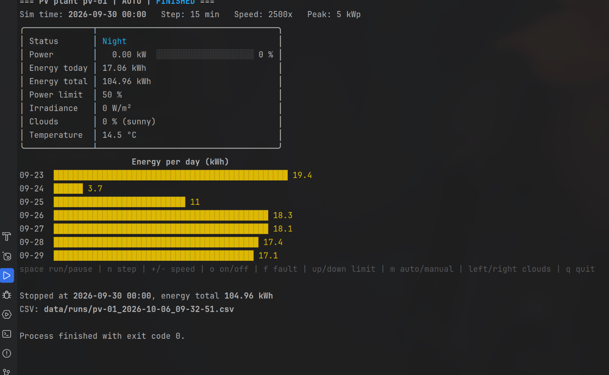
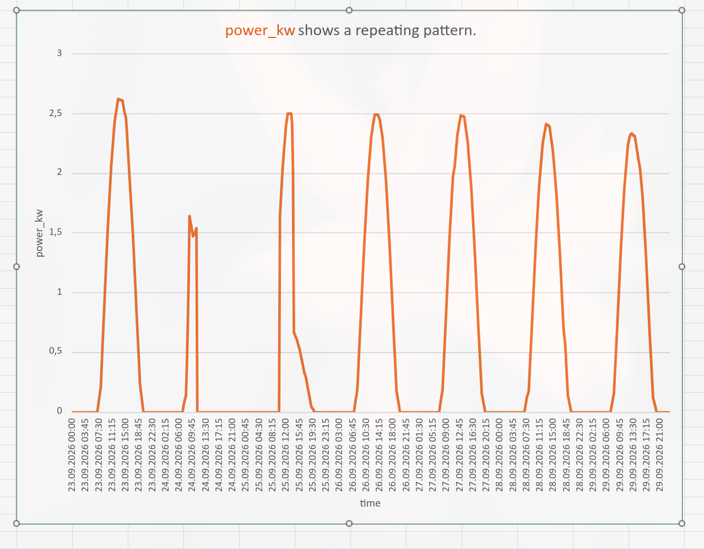
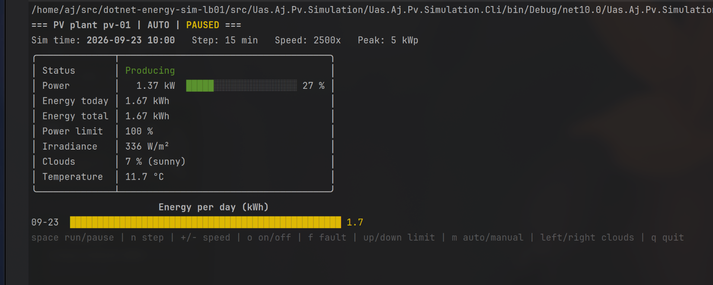
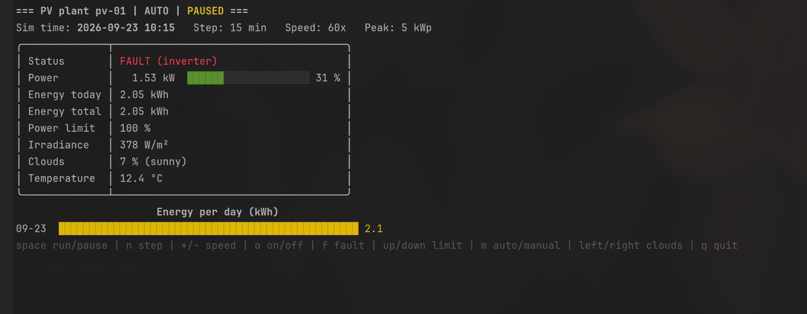
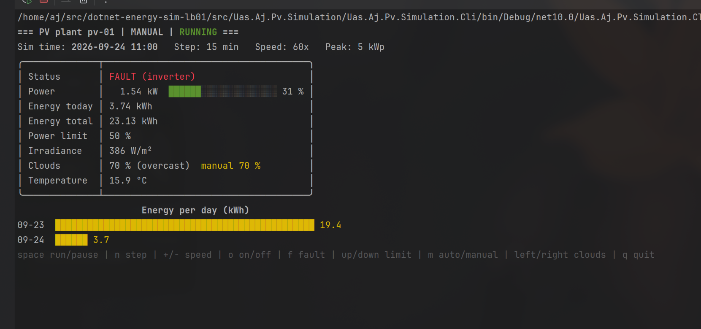
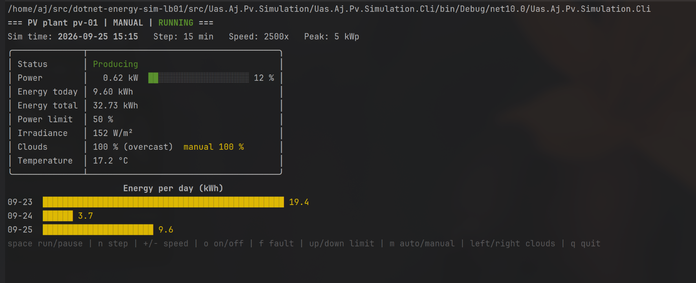

# PV Plant Simulator (LB01)

Console simulator of a PV plant. Real Salzburg weather, manual + automatic mode, CSV history per run.



## Requirements

- .NET 10 SDK
- JetBrains Rider or terminal with `dotnet`
- start from repo root (weather path `data/...` is relative)
- real terminal for keys (Rider: run config -> "Use external console")

## Start

### Rider profiles

From `src/Uas.Aj.Pv.Simulation/Uas.Aj.Pv.Simulation.Cli/Properties/launchSettings.json`, pick in run config dropdown.

| Profile | Args | Use for |
| --- | --- | --- |
| `Simulation manual` | none | manual debugging: starts paused, step with `n`, breakpoints in `PvPlant.Update` / `SimulationEngine.Step` |
| `Simulation auto (2500x)` | `--speed 2500` | automatic run: full week ~4 min, CSV + screenshots |
| `PvPlant check` | `--check` | model checks, PASS/FAIL, after every change |
| `Help` | `--help` | all options + keys |

- not Rider's default config `Uas.Aj.Pv.Simulation.Cli` -> starts in `bin/`, weather file not found

### Terminal

```bash
dotnet run --project src/Uas.Aj.Pv.Simulation/Uas.Aj.Pv.Simulation.Cli                    # manual mode
dotnet run --project src/Uas.Aj.Pv.Simulation/Uas.Aj.Pv.Simulation.Cli -- --speed 2500     # automatic mode
dotnet run --project src/Uas.Aj.Pv.Simulation/Uas.Aj.Pv.Simulation.Cli -- --help           # all options
```

### Modes

| Start | Mode | State at start |
| --- | --- | --- |
| no options | manual | paused, clouds set by hand (0 %) |
| any option | automatic | running, clouds drift around real weather |

- same keys in both modes, only start state differs

## Options

Format `--name value`, missing option -> default.

| Option | Default | Meaning | Why this default |
| --- | --- | --- | --- |
| `--device-id` | `pv-01` | plant name, part of CSV file name | several plants -> own IDs, own CSVs |
| `--peak-kw` | `5` | nominal power (kWp) at 1000 W/m², 25 °C | typical home roof |
| `--performance-ratio` | `0.8` | all losses as one factor, 0-1 | typical real plants 0.75-0.85 |
| `--start` | `2026-09-23` | first sim day, `yyyy-MM-dd` | first day of weather file |
| `--days` | `7` | sim days | whole weather file, PDF min. 24 h |
| `--step` | `15` | sim minutes per tick = 1 CSV line | PDF example, 96 lines per day |
| `--speed` | `600` | times faster than real time | one day in 2.4 min, still readable |
| `--weather` | `data/salzburg-2026-09-23_2026-09-29.json` | weather file (Open-Meteo) | only week in repo |
| `--history-folder` | `data/runs` | CSV folder, created if missing | next to weather data |

- decimal point `.` (`--peak-kw 7.5`)
- wrong option / value -> message + exit code 1, no stack trace (e.g. `unknown option --peek-kw`, `Required input Days cannot be zero or negative.`)
- start + days outside weather file -> error at start, not mid run

```bash
--speed 2500                                  # full week, fast
--peak-kw 10 --days 1 --speed 1000            # bigger plant, one day
--device-id roof-west --peak-kw 3.2 --step 5  # second plant, finer steps
--start 2026-09-25 --days 2                   # only 25th + 26th September
```

## Keys

| Key | Action |
| --- | --- |
| `space` | run / pause |
| `n` | one step (while paused) |
| `+` / `-` | speed preset up / down |
| `o` | plant on / off |
| `f` | inverter fault on / off |
| `up` / `down` | power limit ±10 % |
| `m` | weather auto / manual |
| `left` / `right` | manual clouds ∓10 % |
| `q` | quit, CSV stays complete |

## Model

### What affects the power

```
cellTemp   = ambientTemp + 0.025 * irradiance          // °C
tempFactor = 1 - 0.004 * (cellTemp - 25)
power      = peakKw * (irradiance / 1000) * tempFactor * performanceRatio
power      = min(power, peakKw * powerLimit / 100)
power      = 0 if off, fault or night
```

| Factor | Effect on power | Value | Why |
| --- | --- | --- | --- |
| irradiance | main driver, linear | from weather file, W/m² | real sun curve, 1000 W/m² = reference |
| peak power | scales everything | `--peak-kw`, 5 kWp | plant size |
| cell temperature | hotter panel -> less power | ambient + 0.025 K per W/m² (~+25 K at full sun) | panels in sun much hotter than air |
| temperature coefficient | -0.4 % per K above 25 °C | 0.004 | typical crystalline silicon (-0.3 to -0.5 %/K) |
| performance ratio | fixed loss | `--performance-ratio`, 0.8 | inverter, cables, dirt, mismatch in one number |
| clouds | less irradiance | in real data; changed by auto drift / manual | see weather |
| power limit | caps output | 0-100 %, keys up/down | feed-in limit, changeable device parameter (PDF) |
| on / off | 0 kW when off | key `o` | manual control (PDF) |
| fault | 0 kW, status Fault | key `f` | inverter fault, trigger + reset (PDF) |
| night | 0 kW, status Night | irradiance = 0 | no sun, no power |

### States

| Status | When |
| --- | --- |
| `Fault` | fault active (wins over all) |
| `Off` | switched off |
| `Night` | irradiance 0 |
| `Limited` | power limit cuts power |
| `Producing` | normal |

### Energy

- per tick: power × step hours
- power at tick start counts for whole step -> smaller step = more exact
- energy today: reset at midnight
- energy total: whole run

### Weather

- Open-Meteo archive, Salzburg, 23.-29.09.2026, hourly
- values: temperature (2 m), cloud cover (%), shortwave radiation (= irradiance, W/m²)
- between hours: linear interpolation -> smooth at any step
- why real data: real day curve + weather change, no own sun model, offline + reproducible (no network in LB01)
- file checked at start: missing field, null value, broken JSON, too short for sim range -> clear error

### Clouds: auto vs manual

- irradiance rescaled to new clouds: `real * factor(new) / factor(real)`
- cloud factor (Kasten-Czeplak): `1 - 0.75 * (clouds/100)^3.4` -> 0 % = 100 % sun, 100 % = 25 % sun
- cap 1100 W/m² (clear sky limit)
- temperature always real

| | Auto | Manual |
| --- | --- | --- |
| clouds | real + random drift | fixed by user, 10 % steps |
| drift | max ±10 % per h, scaled with √time -> same for every step size | none |
| limits | offset max ±50 %, clouds 0-100 % | 0-100 % |
| pull back | to real clouds within ~6 h | - |
| random | new every start, no seed | - |
| why | weather changes slowly; random per tick = flicker (PDF: "möglichst realitätsnah") | test exact situations |

### Time + speed

- step = sim time per tick, fixed at start (`--step`)
- speed = sim time / real time, changeable while running (`+` / `-`)
- real wait per tick = step / speed

| Speed | 1 tick (15 min) | 1 day | 1 week | Why |
| --- | --- | --- | --- | --- |
| 1x | 15 min | 24 h | 7 days | real time, like a real device |
| 10x | 90 s | 2.4 h | 16.8 h | slow, follow every change |
| 60x | 15 s | 24 min | 2.8 h | 1 sim hour = 1 real minute |
| 600x | 1.5 s | 2.4 min | 16.8 min | default, one day readable |
| 1000x | 0.9 s | ~1.4 min | ~10 min | faster overview |
| 2500x | 0.36 s | ~35 s | ~4 min | full week for CSV + screenshots, still readable |

- presets: roughly ×10 apart, easy to step through
- top at 2500x: faster -> display changes too fast to read at 15 min step
- custom `--speed` possible, `+` / `-` jump to next preset

### Not modeled (assumptions)

- horizontal irradiance = panel irradiance (no tilt, orientation, sun angle)
- no shading, snow, aging
- inverter efficiency inside performance ratio, no own curve
- one fault type (inverter)
- weather only one week -> start + days limited

## Output

- one CSV per run: `data/runs/<device-id>_<start time>.csv`
- one line per tick, also single steps with `n`
- pause -> no lines (sim time stops)
- `;` + decimal comma -> opens directly in LibreOffice / Excel (German)

```
time;mode;status;power_kw;energy_today_kwh;energy_total_kwh;power_limit_percent;irradiance_w_m2;cloud_cover_percent;temperature_c
2026-09-23 12:00;Auto;Producing;2,438;6,22;6,22;100;624;0;15,2
```

- interventions visible: `status` (Fault, Off, Limited), `power_limit_percent`, `mode` + `cloud_cover_percent`

### Graph: power over the week

From `data/runs/pv-01_2026-10-06_09-32-51.csv` (`time` + `power_kw`), same run as the screenshots.



- 23.09.: normal day, peak ~2.6 kW (5 kWp × irradiance × temperature × 0.8)
- 24.09. 11:00 -> 25.09. 10:15: fault -> 0 kW despite sun
- 25.09. noon: limit 50 % -> flat top at 2.5 kW (`Limited`)
- 25.09. afternoon: manual 100 % clouds -> drop to ~0.6 kW
- 26.-29.09.: auto, normal days, peak just below 2.5 kW (limit still 50 %, but not reached)
- night always 0 kW

## Screenshots

**Auto, paused at 10:00** - producing, power bar, energy, weather values



**Fault triggered** - status `FAULT (inverter)` at once, power drops to 0 on next tick



**Fault + power limit 50 % + manual clouds 70 %** - several interventions at once, manual mode in header



**Manual 100 % clouds** - overcast, irradiance + power low



**Finished week** - 7 daily bars, 24.09. + 25.09. low because of fault + manual clouds, summary + CSV path


